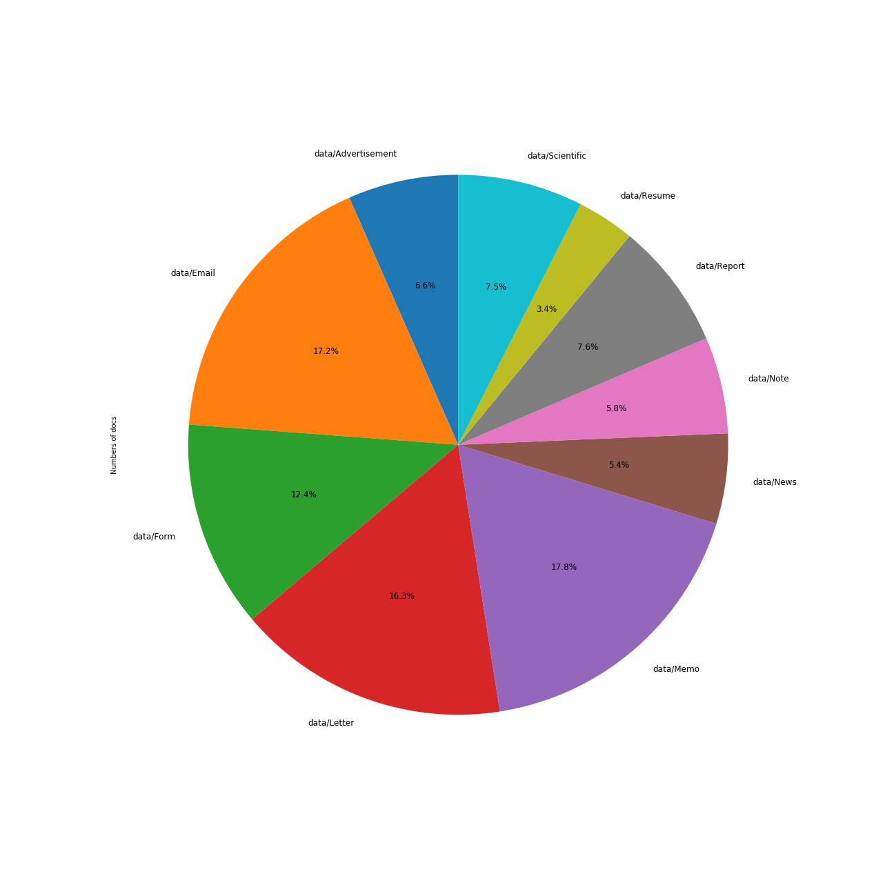

# Classification des documents du procès des groupes américains du tabac
### Hugo LEROGERON

## Introduction 

Pour ce TP, nous disposons d'un corpus contenant des documents texte liés au procès. Ceux ci peuvent être parmi les 10 catégories suivantes:
  * _Advertisement_,
  * _Email_,
  * _Form_,
  * _Letter_,
  * _Memo_, 
  * _News_, 
  * _Note_,
  * _Report_,
  * _Resume_ et
  * _Scientific_.
Pour faciliter le traitement d'autres documents du procès, l'objectif du projet sera de classifier les nouveaux documents dans les catégories ci dessus. 

Pour ce faire, nous étudierons tout d'abord les données dont nous disposons. Nous exposerons ensuite la solution technique trouvée au problème, avant d'en étudier les performances et de réfléchir à diverses améliorations. 

## 1. Analyse des données. 

La première étape à réaliser ici est d'étudier les données que nous avons à notre disposition. Pour cela, nous avons choisi de visualiser le nombre de textes par catégorie ainsi que le nombre de lettres moyen par type de texte.

### 1.1 Nombre de documents par catégorie. 

Nous voyons que les catégories _Letter_,_Email_, _Form_, et principalement _Memo_ sont sur-représentées. De plus, la catégorie _Resume_ est un peu sous-représentée. Cela pourrait avoir son importance en biaisant le classificateur par la suite: celui-ci risque en effet de privilégier les classes sur représentées. 

__Cependant, cette distribution imparfaite n'est pas si importante: la classe la plus représentée n'est représentée qu'à 17.8% soit environ 6 fois plus que la moins représentée . Ainsi, des méthodes de ré-échantillonnage dont l'efficacité est incertaine  paraissent superflues. Il conviendra cependant de vérifier les résultats des classificateurs via matrice de confusion__

## 2. Données et Solutions.