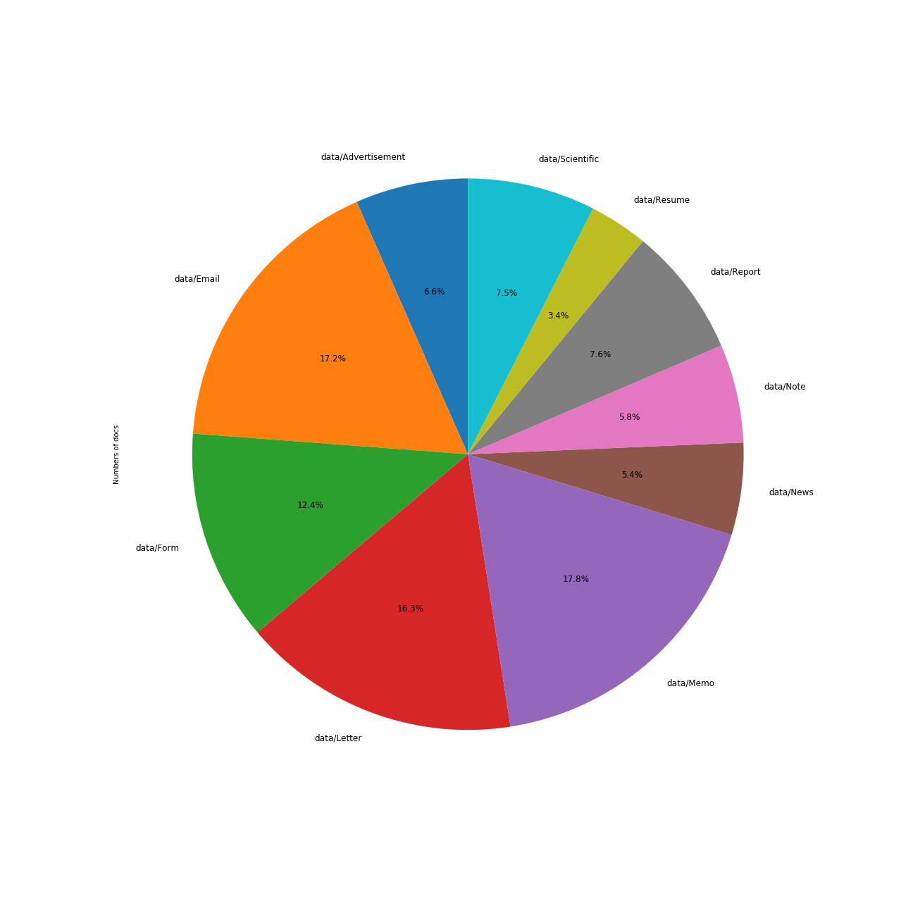
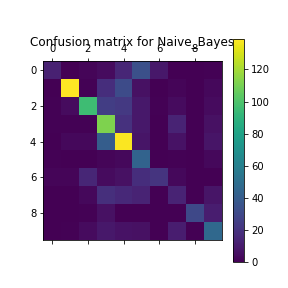
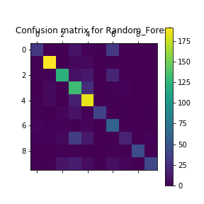

# Classification des documents du procès des groupes américains du tabac
### Hugo LEROGERON

## Introduction 

Pour ce TP, nous disposons d'un corpus contenant des documents texte liés au procès. Ceux ci peuvent être parmi les 10 catégories suivantes:
  * _Advertisement_,
  * _Email_,
  * _Form_,
  * _Letter_,
  * _Memo_, 
  * _News_, 
  * _Note_,
  * _Report_,
  * _Resume_ et
  * _Scientific_.
Pour faciliter le traitement d'autres documents du procès, l'objectif du projet sera de classifier les nouveaux documents dans les catégories ci dessus. 

Pour ce faire, nous étudierons tout d'abord les données dont nous disposons. Nous exposerons ensuite la solution technique trouvée au problème, avant d'en étudier les performances et de réfléchir à diverses améliorations. 

## 1. Analyse des données. 

La première étape à réaliser ici est d'étudier les données que nous avons à notre disposition. Pour cela, nous avons choisi de visualiser le nombre de textes par catégorie ainsi que le nombre de lettres moyen par type de texte.

### 1.1 Nombre de documents par catégorie. 

Nous voyons que les catégories _Letter_,_Email_, _Form_, et principalement _Memo_ sont sur-représentées. De plus, la catégorie _Resume_ est un peu sous-représentée. Cela pourrait avoir son importance en biaisant le classificateur par la suite: celui-ci risque en effet de privilégier les classes sur représentées. 

__Cependant, cette distribution imparfaite n'est pas si importante: la classe la plus représentée n'est représentée qu'à 17.8% soit environ 6 fois plus que la moins représentée . Ainsi, des méthodes de ré-échantillonnage dont l'efficacité est incertaine  paraissent superflues. Il conviendra cependant de vérifier les résultats des classificateurs via matrice de confusion__

## 2. Solution Envisagée.

### 2.1 Pré-traitement des données .

La seconde étape consiste à préparer les données à leur classification. 

Nous avons donc environ 3500 textes appartenant à 1 parmi 10 catégories possibles. Le label est déterminé par le dossier dans lequel le document appartient. On supposera que les labels sont sans erreur. Les données sont ensuite placées sous forme de matrice comptant le nombre de fois un mot est présent dans un document via _sklearn CountVectorizer_. 

Les données sont ensuite séparées en jeux d'apprentissage et de test selon les proportions 2/3 et 1/3.

### 2.2 Classificateur.

Pour avoir une _baseline_, on utilisera d'abord une classification par Bayes naïf. 
Peu importe le classificateur, les prédictions se feront via la méthode classification prenant en entrée le classificateur et les données. 

On tentera ensuite d'améliorer les résultats via un Random Forest.

 Les algorithmes ne seront pas réimplantées mais utilisées via la bibliothèque sklearn. 

### 2.3 Affichage des résultats. 

On mesurera la performance via la méthode _show_results_. Celle ci affichera la matrice de confusion ainsi que diverses métriques comme le score f1, qui nous servira de référence pour les comparaisons. 

## 3. Résultats.

### 3.1 Avec Bayes
On obtient des résultats relativement convenables avec un simple bayes naïf. Le score f1 est autour des 0.58 (de légères variations sont dues à la nature aléatoire de la séparation des données en apprentissage et test) ce qui pour 10 classes est acceptable. 

Les classes ne sont bien aussi bien comprises les unes que les autres par le classificateur cela dit. Par exemple, la classe 2 (_email_) est très bien classifiée avec un score de 81%, contre seulement 31% pour la classe 7 (_Report_). Cela ne semble pas être du au nombre de données car la classe la moins représentée, _Resume,_ obtient un score de 75% contre 61% pour la classe la plus représentée. 

La matrice de confusion illustre bien cette idée: 

  

### 3.2 Avec Random Forest
Comme prévu, on obtient de meilleurs résultats avec le random forest. En effet ce classificateur est en général considéré comme plus "puissant" que le bayes naïf. Le score f1 est de 0.75 en général, ce qui est plutôt bon. 

De nouveau les classes ne sont pas identiquement bien prédites. Les tendances vues avec Bayes se confirment: les classes 2 et 8 sont très bien classés avec 0.95 de score f1. De même, la classe 7 est très mal prédite avec seulement 37% de score f1. Cela est du à un très mauvais recall de 24%: il semble difficile pour les classificateurs de bien retrouver les exemples de documents de type _Report_. Cela peut être du à la faible représentation du document conjugué à une ressemblance globale  aux autre classes.

 On peut le voir sur la matrice de confusion: 
 
 

Les couleurs dans la ligne 7 montre que cette classe est souvent mal prédite: le classificateur préférant l'associer aux classes 3 (_Lettre_) et 4 (_Memo_). 

## 4. Pistes d'améliorations et Conclusion

Le meilleur moyen d'améliorer les performances de notre projet serait d'obtenir plus de données. Si c'est impossible, on pourrait essayer plus de pré-traitement sur les données, comme des représentations TF-IDF, bien que cela ne soit pas toujours utile. 

Pour améliorer les résultats du Random Forest, on pourrait faire de la recherche d'hyper-paramètres par validation croisée mais cela risque d'augmenter artificiellement les performances de notre module: on risquerait le sur-apprentissage et on perdrait en performance avec de nouvelles données. 

On pourrait enfin passer à des modèles de plus grande envergure comme des LSTM en utilisant des _embedding_ comme _Glove_. 

En conclusion, notre modèle permet bien de classifier les textes en fonction de leur catégories, mais la relative imprécision peut mettre en doute les résultats proposés. 

